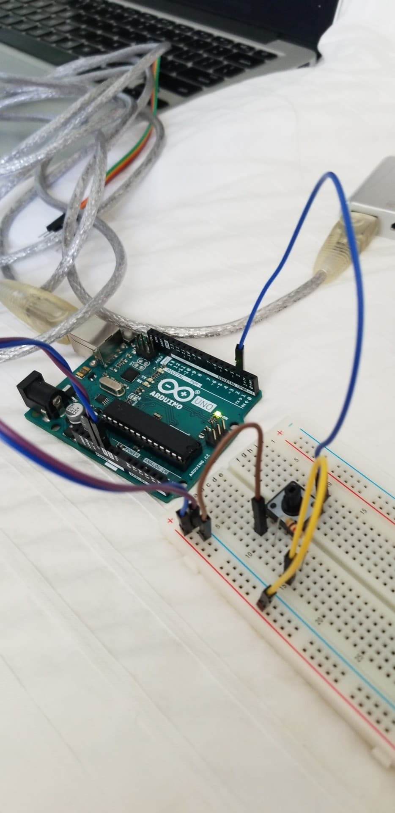

# Add your page title and Kazza Topp-Nguyen
<!--
Welcome to your project page for Electronics for the Rest of Us. You'll use this page to describe and showcase your work throughout the module. 
A place for each deliverable has been created below for you in this markdown document. 
Note that comments (such as this) will not appear in the final markdown document (which you can view with the "Preview" button).
-->


## Day 1: Reflection
<!--
In this section, provide a ~250 word reflection on your first day of the module, and discuss why you're interested in this module and what you hope to take away from it.
-->

Hello World!

Ever since I began university, I kept hearing the words like "coding" and "Python", but I had no idea what they meant. This prompted me to enroll in a free Introduction to Computer Science course on the Harvard Online website. I never kept up with the work and things got in the way. Starting this course today, I finally feel like I am getting the introduction to computer science that I was looking for. Most of the people in the class are also beginning from scratch and the class runs at a pace that I am comfortable with. 

The first day with Markdown was a good introduction because it was simple and easy to follow. Even after one day, I feel as if I am a little bit “in the know” because I can program Github Pages to italicize the words I want italicized. I am really looking forward to working with the package I received of random circuits because it looks like a bunch of random stuff. I am excited that by the end of the week I am going to actually understand what each piece is, what it does, and how I can use them to make something. I am excited to start day 2!



<!--
Inserting an image takes the form: 

See the following webpage for more information: https://github.com/adam-p/markdown-here/wiki/Markdown-Cheatsheet#images
Replace the elements below to insert your picture.
--> 


## Day 2: Results
[My Arduino Thermistor RGB Code](https://github.com/inspire-1a03/intersession-2020-kazzatopp-nguyen/blob/master/thermistor___RBG_v3.ino)

My device interprets its surrounding temperature and displays the temperature as a traffic light. At room temperature, between, its green for GO. When the temperature increases above 28, we are entering yellow and CAUTION. Caution also notifies the user with a medium-pitch sound. When the temperature exceeds 30, its red for STOP and the user is met with an extremely annoying high-pitch sound. Below room temperature, or 22, the light is white. 

The most challenging part of creating this device was merging the RBG and thermistor sketches. You had to very cautious of syntax and ensure you had a closed curly bracket for every open curly bracket. I was lucky enough to have a common anode, I could follow Dr. Brodeur and everything was pretty seamless. I was able to manipulate the code to add intermediate temperature readings and add sound from the buzzer. Overall, it was awesome!


<!--
Upload your fully-commented Arduino sketch from your final Day 2 build task--a thermometer connected to an RDB LED--into your GitHub repository.
Provide a short (~150 words) summary of your work on this circuit:
- How does your device work?
- What was challenging? 
- What worked? What didn't? 
- Be sure to link to your code (in your GitHub repository) in the text of your response.
-->

## Arduino build-off results
<!--
Upload your fully-commented Arduino sketch from the final product of your Arduino build-off into the top-level of your module GitHub repository.
In ~300 words, provide a final device description and product pitch: 
- What does it do? Use a table (created in markdown) to list and describe the features. You can use the template provided below. 
- Describe briefly how it works.
- How could it be used in everyday life (or maybe just in rare cases)? 
- Be sure to link to your code (in your GitHub repository) in the text of your response.
- Include a snippet of code using the ``` ``` characters to display the code properly. 
Finally, record a short (30 second) video of a 'product pitch' for your device. 
- Upload the video to Youtube, and use the sample code below to embed your video.
-->


<!--
Below is a general markdown table template. 
You can find more information at these links: 
- https://github.com/adam-p/markdown-here/wiki/Markdown-Cheatsheet#tables

-->
| Feature | Description | Other Notes |
|---------|-------------|-------------|
|         |             |             |
|         |             |             |
|         |             |             |
|         |             |             |


<!--
Below is an example of embedding a YouTube video in a markdown document for use in GitHub pages. 
Note that this video won't show when previewing the document in GitHub--it only works on the GitHub pages webpage. 
- Once your YouTube video is uploaded, right click and select ```<> Copy embed code```. 
- You can paste this code directly into your markdown document. 
- Note that you may want to adjust the width and height parameters to make it fit well in your webpage
-->

<iframe width="789" height="444" src="https://www.youtube.com/embed/dQw4w9WgXcQ" frameborder="0" allow="accelerometer; autoplay; encrypted-media; gyroscope; picture-in-picture" allowfullscreen></iframe>


## Final reflection & summary
<!--
In ~300 words:
- Summarize your experience in this module. What you learned, what you liked, what you found challenging.
- Reflect upon your learning and its relevance in your life.
-->
